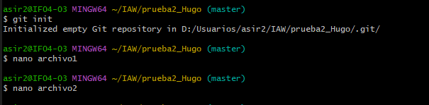
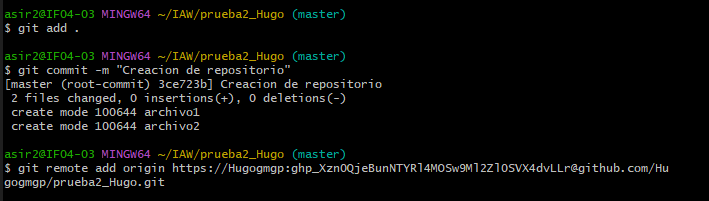
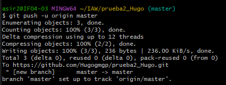
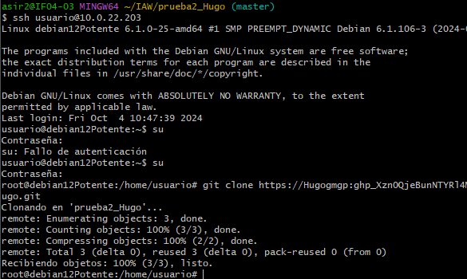
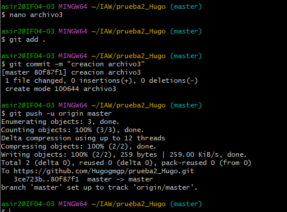
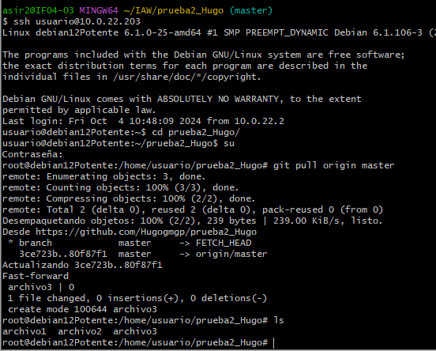

# Ejercicio 14

## .1 En esta ocasión, crea primero el repositorio local en Windows (usando git init). El repositorio debe contener, al menos, dos archivos de texto: archivo1.txt y archivo2.txt. El contenido de ambos archivos es libre.

## .2 Agrega (conecta) el repositorio local con un repositorio remoto en GitHub (usando git remote add).

## .3 Sube el repositorio local a GitHub (usando git push).

## .4 Clona el repositorio remoto en tu máquina virtual Linux Debian (usando git clone).

## .5 Modifica, en Windows, uno de los archivos y añade un 3º archivo de texto llamado archivo3.txt. Confirma los cambios(usando git add, git commit) y súbelos al repositorio (usando git push).

## .6 Actualiza la versión local del repositorio en Linux Debian (usando git pull).
